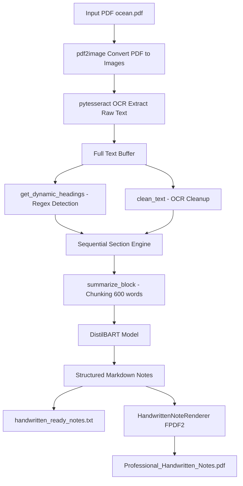

# pdf-to-structured-notes
An OCR and summarization pipeline that transforms long academic PDFs into readable, structured notes, designed to reduce revision time and cognitive load during exam prep.

📚 Smart Notes Processor (Colab Prototype)

A Colab-based prototype that processes student notes. Students can upload PDFs or images, and the notebook extracts, analyzes, and structures the content for easy study.

Key Contributions: I designed the system architecture, problem workflows, and solution approach, ensuring the notebook produces accurate and structured outputs.

🛠 Features (Prototype)

Upload PDFs or images of notes.

OCR-based text extraction (Tesseract).

Summarization and structured output for easier reading.

Modular workflow, ready for future web deployment and potential freemium features.

💻 Tech Stack

Notebook Environment: Google Colab

Programming Language: Python

Libraries: pytesseract, OpenCV, pandas, numpy, OpenAI APIs (optional)
